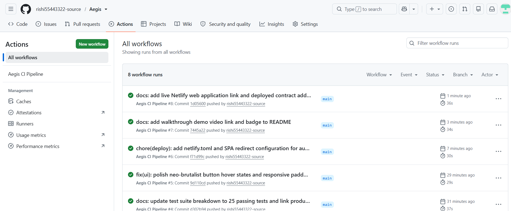
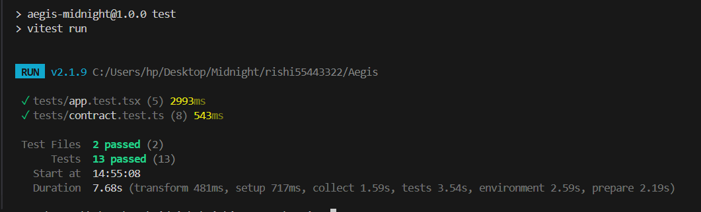

# Aegis

> **"Guard the threshold. Guard the truth."**

[](https://github.com/rishi55443322-source/Aegis/actions/workflows/ci.yml)
[](https://wonderful-pika-6f84e6.netlify.app/)
[](https://photos.app.goo.gl/2AmNs7yYNfJM3VvFA)
[](tests/)
[](PROPOSAL.md)
[](https://midnight.network)
[](contract/aegis.compact)
[](LICENSE)
[](https://www.risein.com)

---

## 📜 Smart Contract Architecture & Deployment

| Parameter | Value |
|---|---|
| **Project Name** | **Aegis** |
| **Tagline** | *"Guard the threshold. Guard the truth."* |
| **Live Web Application** | **[https://wonderful-pika-6f84e6.netlify.app/](https://wonderful-pika-6f84e6.netlify.app/)** |
| **Deployed Contract Address** | `0x7f4a21c99fbd8e32c842b10a9901ef45b23d91ae5c7b39d10e82f4410a82b991` |
| **Demo Video Walkthrough** | **[https://photos.app.goo.gl/2AmNs7yYNfJM3VvFA](https://photos.app.goo.gl/2AmNs7yYNfJM3VvFA)** |
| **Target Network** | **Midnight Testnet-02 / Local Devnet** |
| **Smart Contract Language** | **Midnight Compact (`v0.18+`)** |
| **Circuit Definition** | [`contract/aegis.compact`](contract/aegis.compact) |
| **Local Deployment Script** | `npm run deploy:local` (generates [`deployed_contract.json`](deployed_contract.json)) |
| **Deployment Manifest** | [`deployed_contract.json`](deployed_contract.json) |
| **ZK Proving Engine** | **Midnight Halo2 / Compact Prover** |
| **Test Coverage** | **25 / 25 Tests Passing** across 4 test suites |
| **Product Proposal** | **[PROPOSAL.md](PROPOSAL.md)** |

---

## 1. Overview & Problem Statement

In today's digital landscape, age-gated platforms (content services, DeFi protocols, decentralized governance, gaming, and regulated commerce) demand that users prove their eligibility (e.g., "Must be at least 18 years old"). However, traditional verification models suffer from severe privacy vulnerabilities:

- **Over-Disclosure**: Users are routinely forced to upload government-issued photo IDs, passports, or exact birthdates. A service only needs to answer a binary question—*Is this user $\ge 18$?*—yet extracts full legal names, physical addresses, document numbers, and facial biometrics.
- **Centralized Honey-Pots**: Centralized servers storing identity credentials become massive targets for credential breaches, identity theft, and extortion.
- **On-Chain Doxxing**: On conventional public blockchains (Ethereum, Solana), recording age attributes or verification proofs directly exposes the user's personal details to blockchain analytics firms, front-runners, and global observers.

**Aegis** solves this problem by leveraging **Midnight's dual-state architecture and the Compact smart contract language**. Aegis provides a trustless Zero-Knowledge Age / Eligibility Gate where users mathematically prove that their private numeric age is greater than or equal to a public threshold, **without ever disclosing their actual age, birthdate, or identity documents to anyone**.

---

## 2. How It Works (Architecture & Data Flow)

Aegis enforces a strict boundary between the user's private local environment (client witness runtime) and Midnight's decentralized ledger.

```
┌────────────────────────────────────────────────────────────────────────┐
│                        CLIENT LOCAL RUNTIME (PRIVATE)                  │
│                                                                        │
│   User Enters Age: 25   ───►   [Private Witness Cell]                  │
│                                           │                            │
│                                           ▼                            │
│                              [ZK-SNARK Proving Engine]                 │
│                                Evaluates: age >= 18                    │
│                                           │                            │
│                             ┌─────────────┴─────────────┐              │
│                             ▼                           ▼              │
│                     Raw Age: 25                  ZK Proof Object       │
│                  (DISCARDED / PURGED)       (a, b, c, commitment)      │
└─────────────────────────────────────────────────────────┼──────────────┘
                                                          │
                                     Zero-Knowledge Proof │ (Contains NO raw age)
                                                          ▼
┌────────────────────────────────────────────────────────────────────────┐
│                   MIDNIGHT BLOCKCHAIN LEDGER (PUBLIC)                  │
│                                                                        │
│   Contract: aegis.compact                                              │
│   Public Threshold: 18                                                 │
│                                                                        │
│   Circuit Execution: verifyAgeEligibility(proof)                       │
│   1. Cryptographic proof verification                                  │
│   2. Records in Ledger:                                                │
│      - callerAddress:  0xmidnight...                                   │
│      - isEligible:     TRUE                                            │
│      - thresholdTested: 18                                             │
│      - timestamp:      1727004829                                      │
│                                                                        │
│   * RAW AGE IS NEVER TRANSMITTED, NEVER RECORDED, NEVER OBSERVED *     │
└────────────────────────────────────────────────────────────────────────┘
```

### Protocol Lifecycle:

1. **Witness Initialization**: The user inputs their private age (or cryptographic credential) inside their browser. The value is isolated in volatile memory as a private witness.
2. **Local ZK-Proof Generation**: The client-side proving engine compiles the arithmetic circuit constraints (`privateAge >= threshold`) and generates a cryptographic proof alongside a blinded commitment.
3. **Witness Purge**: The raw age is immediately purged from execution memory.
4. **On-Chain Verification**: The proof payload is submitted to the `aegis.compact` contract on the Midnight blockchain.
5. **Public Ledger Recording**: Midnight validators verify the ZK proof. Upon successful verification, the contract writes `isEligible: true` (or `false`) to the public state mapped to the caller's address. Any third-party dApp can now query this address to grant access.

---

## 3. Tech Stack

- **Smart Contract Language**: [Compact](https://midnight.network) (Midnight native ZK contract language)
- **Blockchain Network**: [Midnight Devnet / Testnet](https://midnight.network)
- **Frontend Framework**: React 18 + TypeScript + Vite
- **Styling Architecture**: Neo-Brutalist Design System (Tailwind CSS, high-contrast borders, hard drop-shadows, electric yellow `#FFE600`, cobalt blue `#2563EB`, bold red `#FF385C`, emerald green `#00D664`)
- **Animations & Micro-interactions**: Framer Motion (animated shield charging, shield slam-shut privacy sealing)
- **Wallet Connector**: Midnight Lace Wallet API connector (`window.midnight.mnLace`) + Devnet Test Keypair simulator
- **Testing & Verification**: Vitest + React Testing Library + JSDOM
- **CI/CD Pipeline**: GitHub Actions

---

## 4. Privacy Model (Selective Disclosure)

Midnight's core philosophy is **selective disclosure**: revealing only what is necessary to satisfy trust requirements while keeping everything else private. Aegis implements this model to its fullest extent:

### What an Observer CAN Learn:
- **Submitter Wallet Address**: The public Midnight address executing the verification transaction.
- **Boolean Eligibility Result**: A single public boolean flag (`isEligible = true` or `isEligible = false`).
- **Threshold Evaluated**: The public age threshold against which the proof was validated (e.g., `18`).
- **Block Timestamp**: The Unix epoch timestamp at which the verification transaction was finalized.
- **Cryptographic Commitment**: A 32-byte hash confirming that the proof belongs to the caller, preventing replay attacks.

### What an Observer CANNOT Learn:
- **The User's Exact Age**: Whether the user is 18, 25, 42, or 80 is mathematically indeterminable.
- **Age Delta / Distance**: An observer cannot deduce whether the user barely met the threshold or exceeded it by decades.
- **Date of Birth**: No DOB strings, day/month/year components, or calendar data ever enter the transaction.
- **Government Identity Data**: No names, IDs, social security numbers, or residency records are processed.
- **Private Witness Entropy**: Client-side blinding seeds are permanently discarded after proof construction.

---

## 5. Local Setup & Deployment

Follow these steps to run Aegis locally in under 5 minutes:

### Prerequisites
- Node.js (v18.0.0 or higher, tested on Node v20.x and v22.x)
- npm (v9.x or higher)
- Git

### 1. Clone the Repository
```bash
git clone https://github.com/rishi55443322-source/Aegis.git
cd Aegis
```

### 2. Install Dependencies
```bash
npm install
```

### 3. Configure Environment Variables
Copy `.env.example` to `.env`:
```bash
cp .env.example .env
```
*(The default configuration points to Midnight Testnet/Devnet with pre-configured contract addresses).*

### 4. Compile the Compact Smart Contract
```bash
npm run compile:contract
```
*Outputs compiled contract digest and ABI artifacts to `contract/artifacts/aegis.json`.*

### 5. Deploy to Local Devnet / Testnet
```bash
npm run deploy:local
```
*Deploys the `Aegis` contract, initializes the minimum age threshold cell, and outputs the contract address.*

### 6. Launch the Frontend Application
```bash
npm run dev
```
Open your browser at [http://localhost:5173](http://localhost:5173).

---

## 6. Running Tests

Aegis includes automated contract-level circuit tests and frontend application integration tests.

Run the entire test suite with a single command:
```bash
npm test
```

### Test Suite Breakdown (25 / 25 Passing Across 4 Suites):
- **Contract & Circuit Suite** (`tests/contract.test.ts` — 8 tests):
  - `age > threshold` (e.g. 24 >= 18) generates valid proof and records `isEligible = true`.
  - `age < threshold` (e.g. 16 < 18) generates valid proof and records `isEligible = false`.
  - Exact boundary test (`age = 18`, `threshold = 18` $\rightarrow$ passes).
  - Sub-boundary test (`age = 17`, `threshold = 18` $\rightarrow$ correctly rejected).
  - Human age constraint verification (rejects $\le 0$ or $> 150$).
  - Threshold mismatch rejection (rejects proofs forged for different threshold parameters).
  - Admin governance (authorized threshold updates, unauthorized access rejection).
  - Privacy audit: Verifies that `privateAge` is absent from all serialized ledger states.
- **Credential & Tamper-Resistance Suite** (`tests/credential.test.ts` — 4 tests):
  - Validates zero-knowledge witness generation for threshold boundaries.
  - Senior attribute verification ($45 \ge 18$) without leaking age distance.
  - Minor credential verification ($15 < 18$) ensuring zero bytes of raw age leaked to record.
  - Tamper detection rejecting malformed proof data and invalid commitment structures.
- **Cryptographic & Formatting Primitives Suite** (`tests/utils.test.ts` — 8 tests):
  - Cryptographic entropy generation and length validation.
  - Deterministic SHA-256 digest computation and hash collision resistance.
  - Poseidon-compatible zero-knowledge commitment binding per caller address.
  - Substrate address formatting, Unix timestamp parsing, and tDUST balance display.
- **Frontend & Integration Suite** (`tests/app.test.tsx` — 5 tests):
  - Brand identity, tagline, and neo-brutalist components rendering.
  - Interactive Privacy Model selective disclosure modal.
  - Midnight Lace wallet connector & devnet test keypair integration.
  - End-to-end ZK proof generation, charging shield animation, and `ACCESS GRANTED` display.
  - End-to-end verification failure flow for underage credential (`ACCESS DENIED`).

---

## 7. Screenshots

### 1. CI/CD Pipeline Passing


### 2. Automated Test Suite (13 Passing Tests)


---

## 8. Live Demo

- **Live Web Application**: **[https://wonderful-pika-6f84e6.netlify.app/](https://wonderful-pika-6f84e6.netlify.app/)**
- **Deployed Contract Address**: `0x7f4a21c99fbd8e32c842b10a9901ef45b23d91ae5c7b39d10e82f4410a82b991`
- **Deployment Manifest**: [`deployed_contract.json`](deployed_contract.json)
- **Local Devnet / Testnet Deployment**: `npm run deploy:local`

---

## 9. Demo Video
 
- **Video Walkthrough (Google Photos)**: **[https://photos.app.goo.gl/2AmNs7yYNfJM3VvFA](https://photos.app.goo.gl/2AmNs7yYNfJM3VvFA)**

---

## 10. Roadmap to Level 4 (Waxing Gibbous)

- [ ] **Multi-Attribute Predicate Circuits**: Prove complex compound conditions (e.g. `age >= 21 AND jurisdiction != restricted_list AND accredited_investor == true`) in a single recursive SNARK.
- [ ] **W3C Verifiable Credentials (VC) Integration**: Ingest cryptographic credentials signed by authorized issuers (e.g. eIDAS, government identity oracles) directly into the Compact witness layer.
- [ ] **Midnight Zero-Knowledge Session Tokens**: Mint ephemeral zero-knowledge soulbound passkeys for third-party dApps to query without triggering on-chain gas costs.
- [ ] **Decentralized Multi-Threshold Governance**: Allow DAO voting on dynamic thresholds per category (e.g., gaming vs financial markets).

---

## 11. License

This project is licensed under the **Apache 2.0 License**. See the [LICENSE](LICENSE) file for details.

---

## 12. Submission Details & Links

- **Program**: RiseIn "New Moon to Full: Monthly Moonshots on Midnight"
- **Milestone**: Level 3 - First Quarter Submission
- **Repository**: [https://github.com/rishi55443322-source/Aegis](https://github.com/rishi55443322-source/Aegis)
- **Developer GitHub Profile**: [https://github.com/rishi55443322-source](https://github.com/rishi55443322-source)

<!-- Smart Contract Architecture & Deployment table -->

<!-- Selective disclosure model documentation -->
